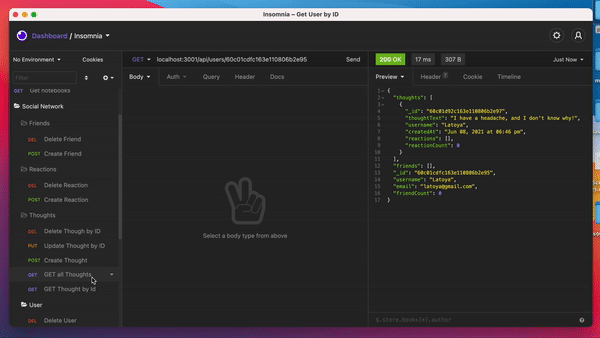
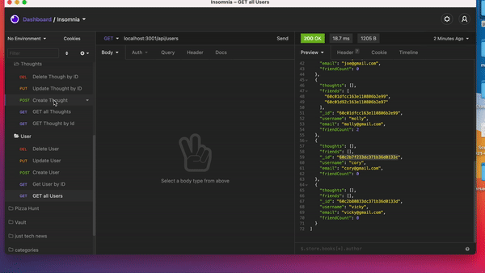
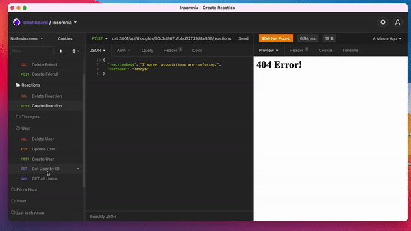
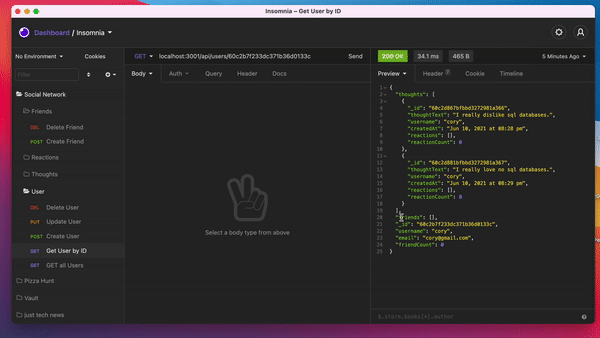

# social-network-api

## Purpose
Your challenge is to build an API for a social network web application where users can share their thoughts, react to friends’ thoughts, and create a friend list.

## Built with 
* JavaScript
* Express.js
* MongoDB database
* Mongoose ODM

### GET, POST, PUT, DELETE Routes for User

### GET, POST, PUT, DELETE Routes for Thought

### POST & DELETE Routes for Reaction

### POST & DELETE Routes for Friend

## User Story
* AS A social media startup
* I WANT an API for my social network that uses a NoSQL database
* SO THAT my website can handle large amounts of unstructured data

## Acceptance Criteria 
* GIVEN a social network API
* WHEN I enter the command to invoke the application
* THEN my server is started and the Mongoose models are synced to the MongoDB database
* WHEN I open API GET routes in Insomnia Core for users and thoughts
* THEN the data for each of these routes is displayed in a formatted JSON
* WHEN I test API POST, PUT, and DELETE routes in Insomnia Core
* THEN I am able to successfully create, update, and delete users and thoughts in my database
* WHEN I test API POST and DELETE routes in Insomnia Core
* THEN I am able to successfully create and delete reactions to thoughts and add and remove friends to a user’s friend list

## Website
*  https://github.com/latoyadawson/social-network-api

## Contribution
Made with ❤️  by  Latoya Dawson
